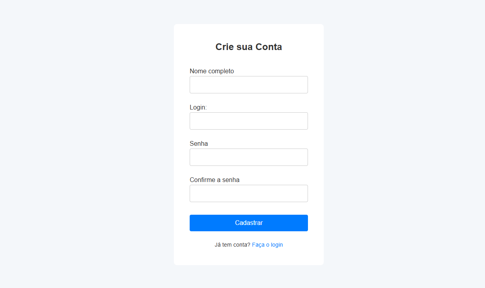
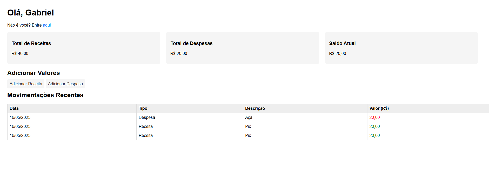
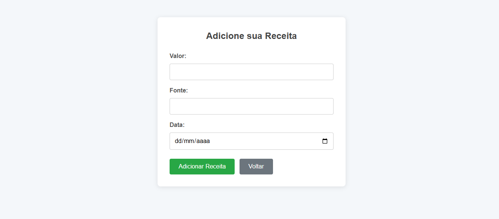
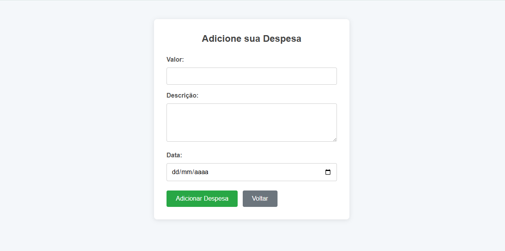

<h1 align="center"> Sistema de Cadastro de Proprietários </h1>

## 💻 Projeto

Este é um projeto de um sistema gestão de finanças simples, onde você tem controle das suas receitas e das suas despesas, desenvolvido com foco no aprendizado de PHP e MySQL. A aplicação permite adicionar receitas e despesas, além de visualizar seu saldo disponível, a data e a descrição de cada movimentação.

Versões utilizadas: Xampp v3.3.0 | MySQL v10.4.32-MariaDB | PHP v8.2.12

## 🚀 Tecnologias

Esse projeto foi desenvolvido com as seguintes tecnologias:

- HTML5 e CSS3 - Estrutura e Estilização
- PHP - Backend
- MySQL - Banco de dados
- DBeaver / Xampp - Ferramentas de gerenciamento de banco de dados e servidor local.

 Página de Login
  

 Página de Cadastro
  

 Dashboard
  

 Adicionar Receitas
  

 Adicionar Despesas
  

